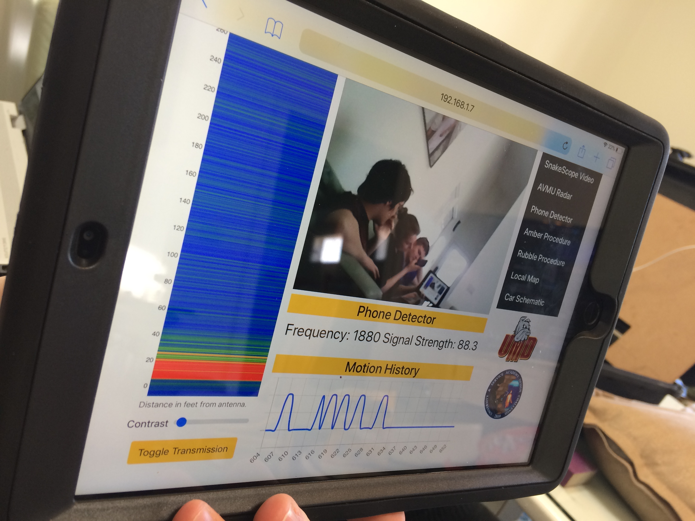

**QUICK START GUIDE**

Here is what to expect in this guide: First the radar operator's gear will be prepared, then the field operator's, next the iPads will be prepared, and last an operator can choose to wear the equipment and operate it. **ORDER MATTERS.** _Words in italics describe what is going on in the software._

**ATTENTION BEFORE SETUP**

**During the removal of the AVMU at the competition, the routers epoxy broke and it is now loose in the pelican case. Therefore, only orient the pelican case in the manner shown below.**

**The Phone Detector's data port has the USB cable hot glued into place. This is because the COTS Wolfhound was not designed to be plugged in and transported simultaneously. Don't break the seal.**

**Radar Operator**


Figure 1: Orientation of the Radar Operator's Pelican case and components inside.

1. **Orient the pelican case as shown above.**
Open the Radar Operator's black Pelican case.
2. Lift off the wood panel that the AVMU antenna were mounted on to reveal battery.
3. Power on the battery velcroed into the pelican case. If the battery is not charged, you may not proceed with the procedure until it is charged. When the battery is powered on you should see lights blinking on the router and later hear the fan on the beagle board spinning. Do not tip or jostle around pelican case.
4. On a separate computer, connect to the network "Netgear65" with password "orangeonion830"
5. In an SSH client on that computer, enter the following commands:
```
   ssh debian@192.168.1.7
```
   When prompted for a password, enter
   ```
   temppwd
   cd ~/devices/beagle_avmu_py/src
   python3 BeagleAvmu.py
```

_The router provides the local area network (LAN) that the devices connect to. Sensor data is transported from the sensors through the LAN and onto the User Interface.  If the AVMU was still there the Beagle Board would start collecting data from the AVMU on powerup._

1. Once components are powered on, while maintaining current orientation close pelican case, and set the Pelican case aside.

**Field Operator**


Figure 2: Field Operator's lumbar pack and components inside.


Figure 3: Names of SnakeScope components

1. Check the power level of the large black USB power pack and the two white smaller power packs. They were left in the lumbar pack at the university. If they are not charged you may not proceed with the procedure until it is charged.
2. Before powering on the field operators raspberry pi, plug in (if not plugged in already):
   1. the Phone Detector in one of the Raspberry Pi's USBs. **Be mindful of the hot glue seal.**
   2. the SnakeScope camera in one of the Raspberry Pi's USBs
   3.  the SnakeScope Microphone Input in one of the Raspberry Pi's USBs
   4.  the SnakeScope Microphone Input's two power cables, plug each one into its own small white power pack. Note the picture above shows one of the microphone cables connected to the black power supply but now each microphone power cable gets its own white power pack.
   5. the headphones into the Raspberry Pi's Auxiliary Port
   6.  the power cable for the Raspberry Pi's into the large black USB Power Supply
3. Place the headphones in your ears.
4. Power on the Phone Detector by pressing the black button in the middle of the key pad. You should see a screen similar to this below…


Figure 4: Phone Detector default

If the phone detector is not charged, you may not proceed with the procedure until it is charged.

1. Power on the Raspberry Pi by pressing the button on the power cord. As the Raspberry Pi is turning on you will start to hear sound coming from the headphones and the Phone Detector will display the text "USB Control"

_As the Raspberry Pi powers on three services run. The first starts the microphone collection, the second starts the Phone Detector data collection/ transportation, and the third starts the SnakeScope data collection/ transportation._

**Motion Detector**

1. Flip on the motion detector sensor so the switch is pointed to the green color. Flip on the motion detector receiver (connected to the glasses) so that the switch is pointed to the green color. In a few moments you should see the sensor and the glasses' lights blink as motion is being detected.

_As the Motion Detector powers on it connects to the LAN so that the data can be shared to the receiver (glasses) and User Interface. Therefore, the Motion Detector sensor cannot communicate to the glasses without the LAN on, located in the Radar Operator's pelican case._


**iPads**

1. Power on an iPad. If the iPad is not charged, you may not proceed with the procedure until it is charged.
2. Navigate to the iPad's wifi options and make sure it is connected to "Netgear65" this is the local area network being broadcasted. If you are prompted for a password it is  "orangeonion830".
3. Navigate to the iPad's Safari options in settings, scroll down, and click the blue "clear all" button.
4. Open Safari and type in the web bar "192.168.1.7:8080" this is the web address of the user interface being hosted by the beagle board. You should see this...



Figure 6: Working User Interface


**Wearing the Equipment**

Here is how we mounted the equipment to the field operator. Without the AVMU in the Radar Operator's pelican case, the pelican case is solely there to provide the LAN and the User Interface.


